# xbmc(kodi) 설정법

### 연결방법
#####1.VIDEOS - Files 클릭
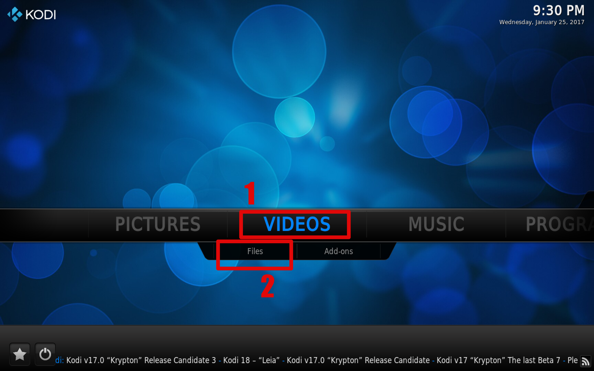
  
#####2.Add videos 클릭
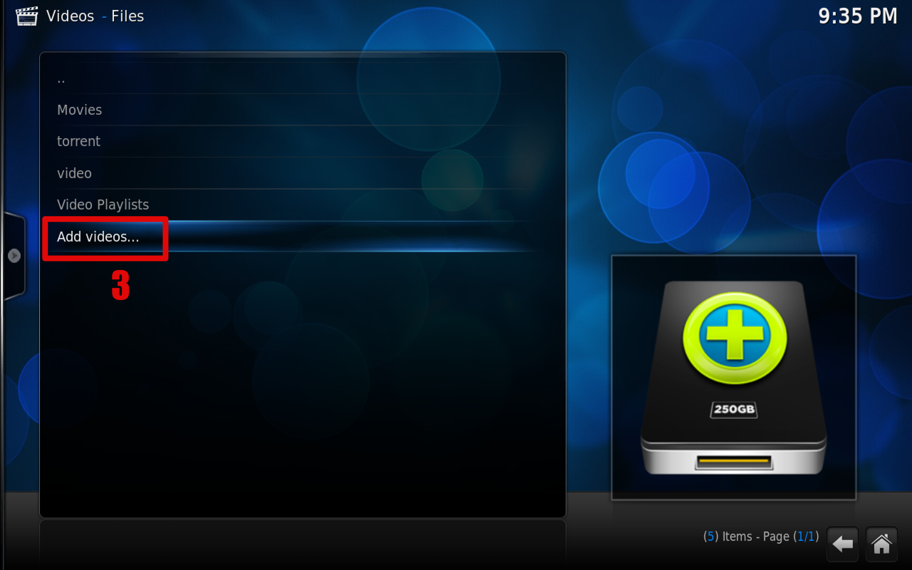

#####3.Browse 클릭
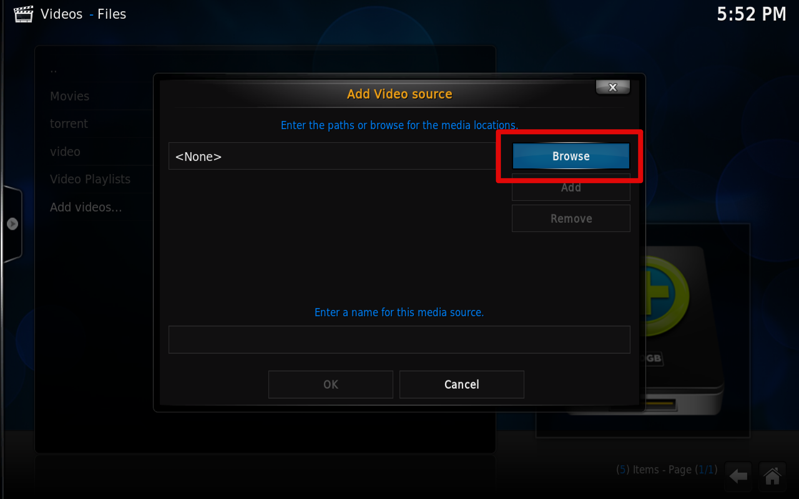

#####4. Add network location 클릭
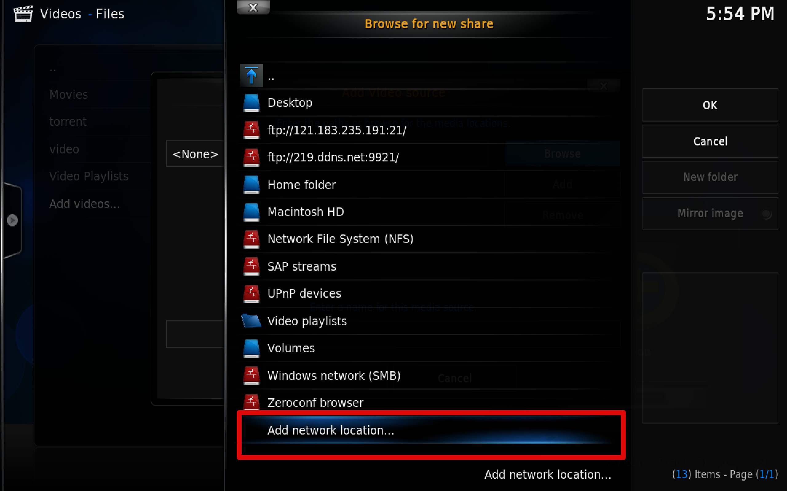

#####5.접속정보 입력
>1. protocol은 FTP Server 선택  
>2. Server Address 는 219.ddns.net 입력  
>3. Port는 9921 입력  
>4. Username(id) 입력  
>5. Password 입력. 
>6. ok 클릭
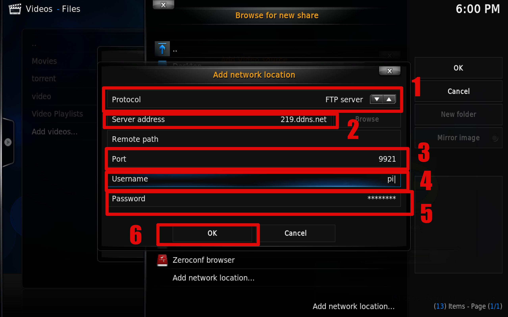  

#####6. 접속정보 확인 후 클릭
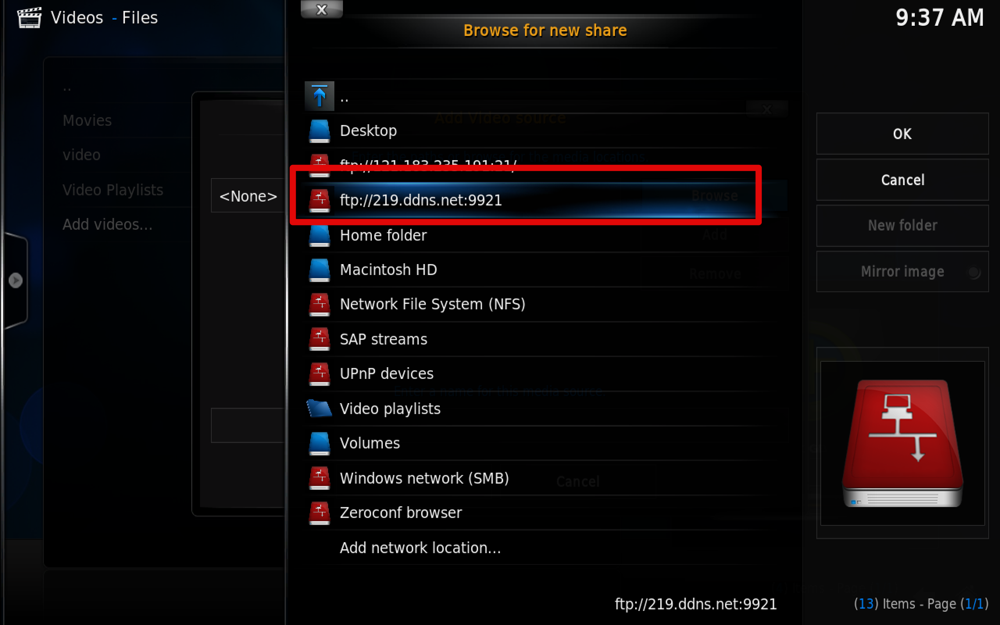 

#####7. torrent 클릭
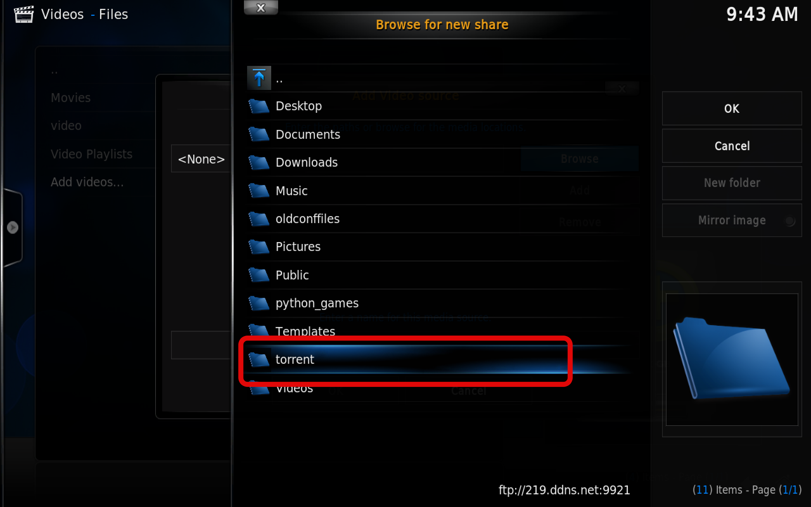

#####8. ok클릭
 

#####9.ok클릭
 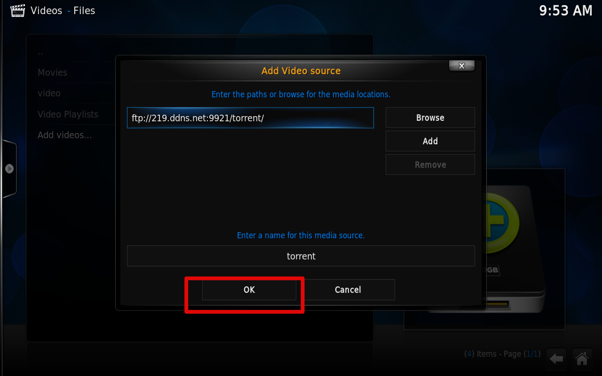

#####10.ok클릭
 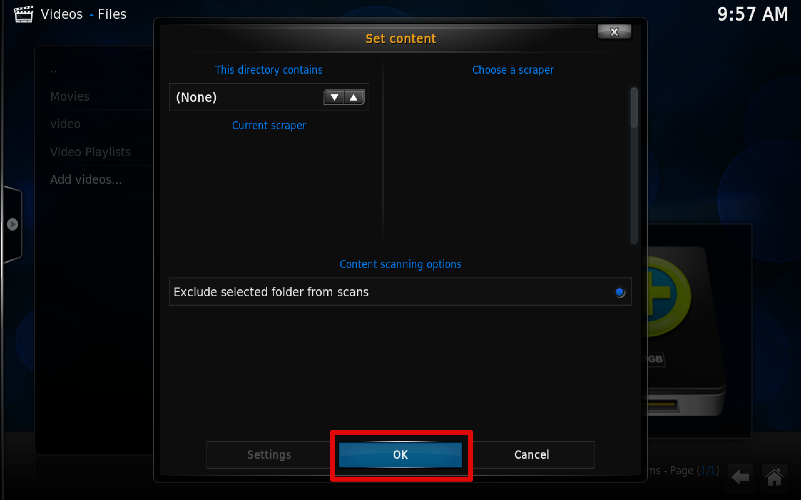

#####11.yes클릭
 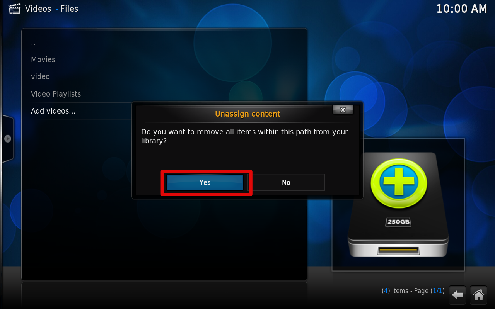

#####12.목록에 추가되었으면 성공
 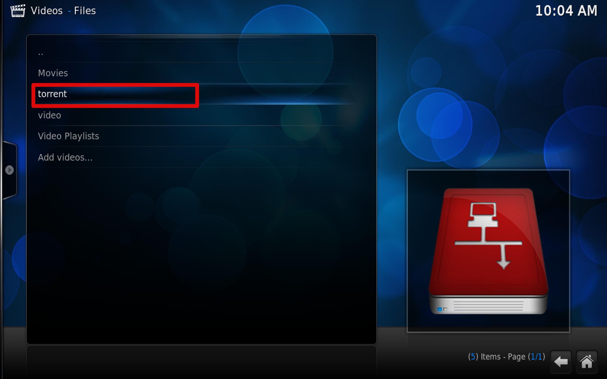

~~#####한글설정방법~~